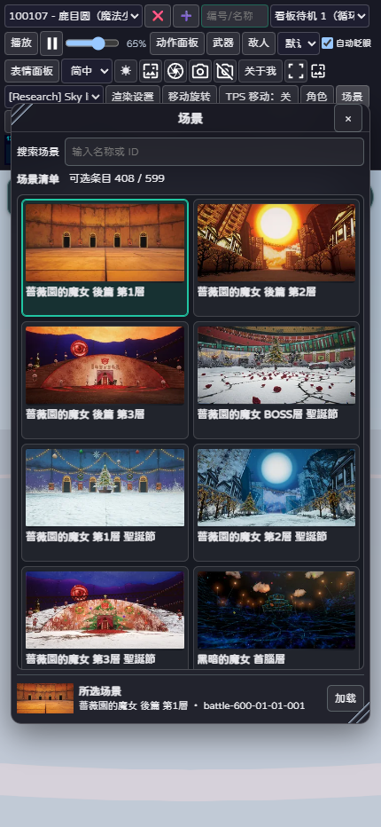
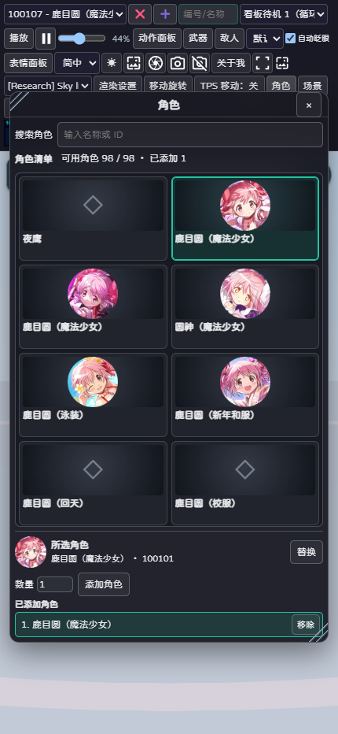
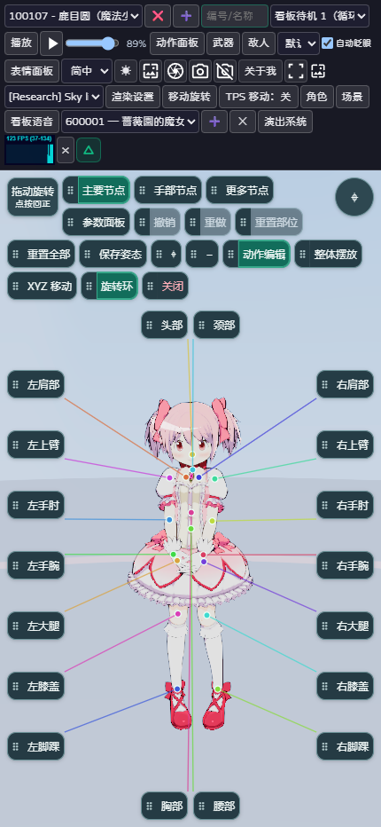
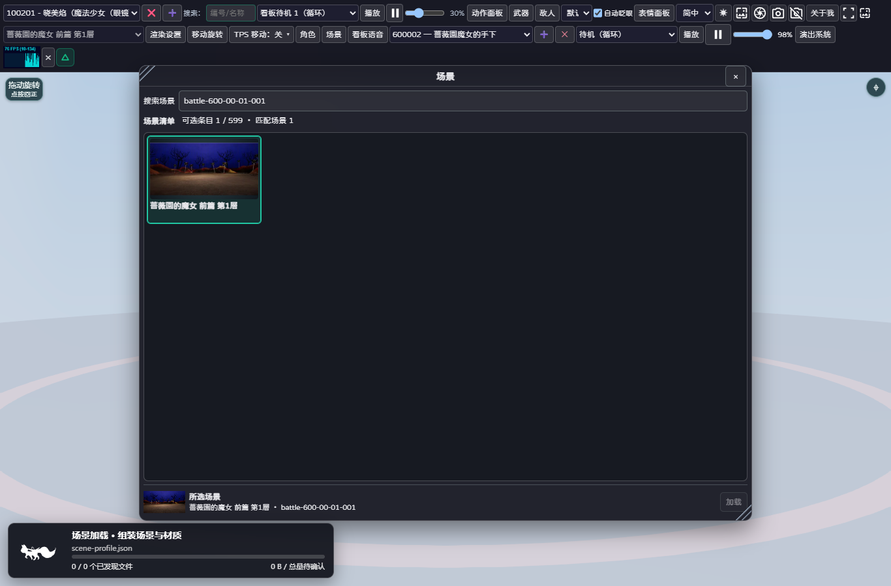

# 2026-10-02：紧凑资源面板、实例增换与镜头控件避让

## 正式发布

正式站：`https://magius3dviewer.pages.dev/`。应用版本 `db8e279a67b9f4e5ab88577a0b5a4d44ad335b52`，Cloudflare 生产部署 `4663c23a`。

应用提交依次为 `5bb3935`（资源面板、工具栏与行为接线）和 `db8e279`（敌人计数只在清单标题行出现）。全部直接提交、推送既有 `magius3dviewer` 分支；没有新分支、PR 或强推。Cloudflare 原项目生产发布标签为 `main`，这不意味着切换了 Git 工作分支。

正式域名的 HTML、版本、资源交付目录及所有现代／兼容版 JavaScript、CSS 共 34 个文件，均逐字节摘要匹配本次构建。部署包 4,705 个文件，单文件和文件数检查通过；没有重新发布原始游戏资源。

## 工具与工作区

工作区：`D:\magia\MyProducts\Magius3Dviewer-Cloudflare`。AgentDock 执行、写入、回读、Git 推送和 Wrangler 发布均实际成功，执行工具报告 sandbox disabled。此前“只读”结论不能作为项目阻塞。操作前核对本地和远端都为 `dd6422f`，已跟踪工作树无待避让修改；未跟踪资源、旧测试产物全部保留。

## 顶部工具栏和视口

- TPS 按钮按实际文字宽度布局；多角色入口不再保留长空白。搜索框空状态缩至约 76px，仅输入更长内容时按需增长。
- 表情默认项显示“默认”，中文选择框按两个字和箭头确定宽度，原始表情值不变。
- 原“默认”数字框其实是播放次数，不是动作选择器。它移入动作参数面板，明确说明自动／0 循环；敌人的次数设置移入敌人面板的紧凑折叠设置。播放、暂停、续播、拖动进度和每实例次数草稿仍被回归覆盖。
- 性能图回到演出系统之后，附独立关闭按钮；渲染设置可以重新启用，保留浏览器偏好。旧浮层的 pointer-events:none 与内部缩放覆盖已消除，实际鼠标点击关闭／重启均验证。
- 画面旋转控件在左、一次性角色聚焦在右。二者作为默认布局的优先避让矩形；编辑按钮优先利用同一行剩余空间，不添加整条空白占位。手工拖拽的有意位置不被自动纠正。
- 移除正面／背面排布切换入口，正面观察者左右命名及骨骼身份不变；仍可用独立拖拽柄自定布局。

## 资源面板

角色、场景、敌人采用相同骨架：标题、同行搜索、同行统计、可滚动缩略图清单、固定底部。大预览卡和整窗滚动移除。

手机清单默认两列，四种验收尺寸均至少能同时完整看见四项；人物和敌人缩略图按小图固定框显示，场景保留 16:9。清单滚动不会挪走所选项和操作。所选人物／敌人图 40×40px，场景图 64×40px；两行文字与“替换／加载”处于同一行。已添加列表固定在底部，必要时仅列表自身小范围滚动。选择绿框是已选状态，不依赖 hover。

搜索标签和输入框同排；“清单／可用或可选／已添加”同行。场景统计不再展开“待恢复”等多行信息，但没有把未还原场景伪装为可用或删除目录记录。敌人成功增删信息不重复占一个计数行，加载和失败消息保留。

武器面板沿用现有发现与添加逻辑，搜索／字段标签和输入同行，相关按钮按内容收紧，没有删除武器功能。

## 实例管理和失败保护

角色支持 1–8 数量添加、多实例选择、替换和删除。替换对象明确取自已添加实例，不是某个同名模型的任意实例；保留旧实例位置、旋转和缩放。数量添加的失败清理由本次创建的实例限定，不移除已有对象。

敌人新增可视网格与替换：先加载新实例，加载成功并确认旧对象仍存在后才替换；失败时保留旧实例。替换保留完整摆放，其他敌人不动。角色和敌人计数都来自实际 live instance 集合，面板操作以及其他入口引起的变化均更新。

调用的是已有真实加载流程，不通过隐藏新模型、预先销毁旧实例或仅修改计数来达成表面行为。

## 验收

`npm run build:deploy` 内的网站回归 587 项通过，零失败、零跳过；TypeScript 与生产构建通过。旧面板测试跟随新交互契约迁移，没有取消播放时间、失败恢复、身份或计数断言；敌人播放测试由手写假 DOM 改成 jsdom。

源页面、静态构建和正式域名分别执行完整浏览器流程，最终各 30 组检查通过。正式站 `production-review.json` 的错误数组为空。覆盖：

1. PC 数量添加两份同模型角色，三个实例 UUID 独立；替换指定中间实例并保留其坐标、四元数、缩放和另一实例 UUID；删除即时计数。
2. 敌人网格选中、数量添加、指定实例替换、其他实例保留、删除与计数。
3. PC 从角色面板添加和从场景面板加载时，对真实网络限速观察实际加载卡。卡片处于弹窗之上，显示真实阶段、已发现文件和字节；没有伪造百分比。随后连续加载两个不同场景。
4. 360×780、430×932、932×430、1366×900：每类网格至少四项、无整窗或页横向溢出；清单滚动后 footer 位置不变；镜头控件与默认编辑按钮的成对矩形重叠为零。
5. 430px 手机模式使用真实 CDP 触控 tap 添加角色／敌人，不是只执行 DOM onclick。武器面板、FPS 关闭和设置恢复也做实际操作。

测试采样修正：最早的记录器在前几个角色下载阶段填满 2,000 个样本，虽然场景加载卡已被截图和断言观察，最终样本检查漏掉了场景。现改为保留每个阶段边界并对重复值按时间采样。正式域名冷缓存下目录晚于角色加载，测试另等待目录实际到达再验收四项布局。这些都是验收脚本的修正，没有修改线上应用或绕过清单／加载断言。

本轮是桌面 Chrome 实际渲染和 CDP 触控／视口仿真，不能冒充所有实体 iOS、Android 浏览器均已逐台认证。

## 保留的边界

原生走跑、跳跃、单向衣物碰撞、物理独立开关、Studio 录制与原始贴图／模型／场景资源未修改；已对相关路径与接手提交作 Git 差异检查。手臂不被衣物反推、双指不误触画面滚转、TPS Ctrl 平移、Esc 释放鼠标和双击重新锁定均由现有回归继续覆盖。

610 云层和 612 烟雾的已知场景还原缺口未在本轮解决，不把 408 个可选场景宣称为全部视觉正确。原有缺失缩略图仍使用明确占位，未冒用其他模型图。安卓偶发首次启动的根因也未因 UI 发布而被证明已根治，独立启动诊断保留。

## 证据

同目录 `assets/2026-10-02-compact-resources/` 包含最终生产回执、34 文件摘要、加载采样，以及实际正式站截图；没有包含浏览器调试入口或任何授权凭据。

