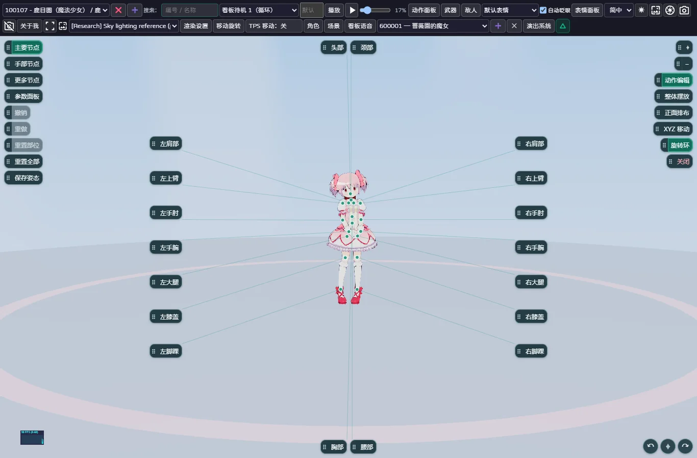
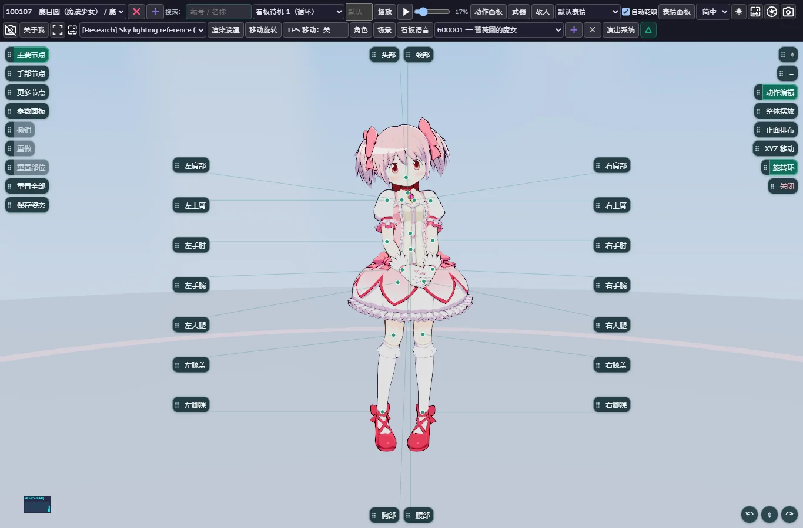
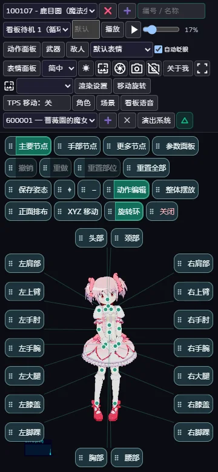
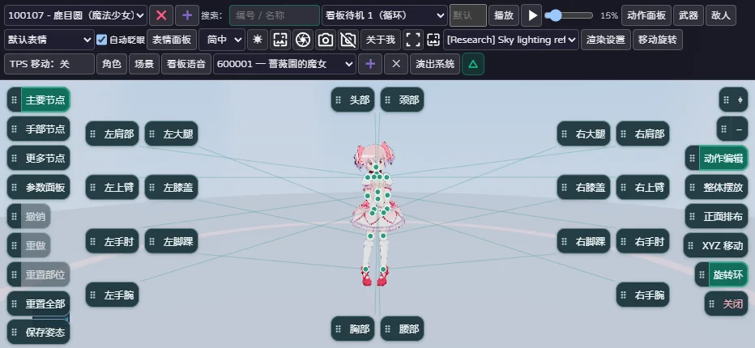
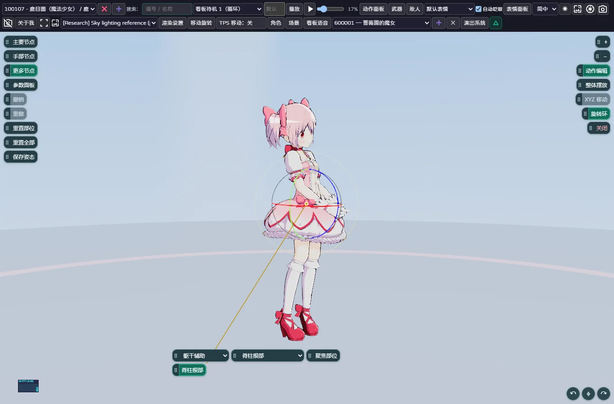

# 正面基准主要节点与躯干语义复核 — 2026-10-02

状态：已部署并完成正式域名复核。应用 `f5100f9615dd282398ce2d689938efe3b3d05bd6`；Cloudflare 部署 `c0645068`。基线 `9fce938`，此前正式站为启动诊断版 `3b72a3d`。Git 分支保持 `magius3dviewer`，没有创建分支或 PR。

## 用户问题与根因

旧 `viewportPoseEditor` 虽然在一次编辑期间缓存位置，但第一次布局仍把所有节点按当前屏幕 X 排序并分成两半、再按屏幕 Y 排序。因此从背面进入、双手交叉或抬起，都能决定一个完全不同的“默认左右列”；缓存仅冻结了错误结果。与此同时 UI 的 L/R 沿用了角色自身的解剖左右，和本次明确指定的“从正面看，屏幕左侧叫左、右侧叫右”不一致。

## 命名与布局契约

- 只改变呈现语义，不更名、不交换、不重绑原始骨骼。当前导入的人形骨架 `Arm_R` / `Hand_R` 在固定正面观察者的左边，`_L` 在右边。内部稳定 ID、蒙皮、动作曲线和保存路径均保留；主要节点、手指页面和骨骼标签采用一致的正面观察者命名。
- 默认主要节点是固定人体示意：头、颈顶部横排；两侧各按肩、上臂、肘、手腕、大腿、膝、脚踝顺序排列，左右对应行齐平。胸部、腰部在底部横排。短横屏将同侧手臂和腿分成两条紧凑纵列，不把左右混杂。
- “正面排布 / 背面排布”按钮只镜像两侧按钮的屏幕位置；标签、原骨骼 UUID、姿态和镜头不变。旋转镜头、从背面进入、切换动作或节点不会自动改名或重新分组。
- 独立拖拽柄、方向键微调和双击柄复位保留。只有主要节点的 UI 偏移采用 `front-v2` 命名空间，避免旧的错列位置覆盖新默认布局；旧数据不删除，姿态存档、手部和工具位置不清除。
- 真实小圆点仍是原骨骼位置，连线跟随最终世界/相机矩阵；标签按钮不因镜头转动而漂移。独立按钮不恢复为大片面板，也没有新增底部说明块。
- 显式“聚焦全身”在主要编辑下使用头颈、底部和侧边按钮留下的区域取景，避免窄屏按钮压住头部。只响应点击，不开启持续聚焦或自动跟踪。更多节点的“聚焦部位”及安全距离策略不变。

## Waist / Spine / Hip 的真实区别

运行 `node scripts/audit-torso-pose-nodes.mjs`。对本地直接可解析的 **97 个 FBX 模型**，记录源文件 SHA-256、原始层级与支点，遍历实际蒙皮权重，再分别围绕 Spine 和 Waist 施加三轴 15° 世界空间旋转，比较真实蒙皮顶点。该范围不是声称审计游戏所有骨架，也不和此前 98 项贴图资源调查混算。

97 个模型均同时含有不同的 Spine 和 Waist。它们的支点间距为 0.04388335～0.15765101 模型世界单位，测试旋转下没有完全等价者。30 个模型在两节点下具有相同的后代影响权重，但旋转支点不同，仍产生不同的顶点结果；其余 67 个连影响权重也不完全相同。

本次截图对应的 100107：`Hip → Spine → Waist → Chest`。Spine / Waist 支点间距 0.07277295，同样俯仰旋转 15° 后，最大顶点位置差为 0.01899755。101401 的支点间距为 0.10054757；101901 的 Spine 还影响某些独立裙带。这些证据不能支持“它们其实是同一个节点”的结论。

为减少主界面重复操作，主要节点仅保留 **Waist（腰部）**；**Spine（脊柱根部）**移至“更多节点 → 躯干辅助”。无 Waist 的骨架仍可用其真实 Spine 作为主躯干控制。Hip 位于躯干和双腿的上游，作为主要界面的整体调整入口容易与“整体摆放”混淆，因此不再列入主要/更多快捷按钮；骨架本身和底层结构数据未删除。

可重跑脚本与完整结果：`scripts/audit-torso-pose-nodes.mjs`、`evidence/2026-10-02-front-nodes/torso-audit.json`。

## 验收与边界

新增单元验证覆盖：前/背面进入时固定命名与顺序；镜头、角色旋转及手臂位置改变后仍保持分列；手动排布后的背面交换只改位置并能精确返回；头颈/躯干行和窄横屏无重叠；左右手指命名一致；显式取景保留光学方向并为界面保留空间。修复了旧 JSDOM 测试只给 HTMLElement 而未给 SVG Element 安装 pointer-capture 测试替身的问题，避免事件异常被测试框架打印后忽略。

浏览器脚本 `scripts/site-smoke-front-nodes.mjs` 在真实 Chrome 上从背面进入再转正面，并测量真实骨骼投影、命名、UUID、镜头/姿态不变、四种尺寸的边界和重叠。也重跑既有 node/TPS 与 final-usability 浏览器回归，涵盖魔女独立修改/保存/载入、原有指尖操作、鼠标 Esc 释放但保持 TPS、角色切换与触控行为。

用户报告安卓第二次/新开页已能进入；朋友目前状态未知。本次没有清缓存、没有移除启动诊断、没有改动作或贴图资源。暂时可用不证明间歇启动故障根因已经确定或修复。模拟/自动化通过也不等于已验证用户朋友的实体安卓设备。

## 发布回执

- 原项目：`magius3dviewer.pages.dev`；原分支推送后使用本机既有 Wrangler 授权覆盖既有 Pages 项目。应用 revision `f5100f9615dd282398ce2d689938efe3b3d05bd6`，部署 `c0645068`。
- `npm run build:deploy`：439 项网站回归通过，0 失败、0 跳过；TypeScript 与生产构建通过。这不是声称历史研究全库失败已经清零。
- 正式站额外节点验收 11 组通过；保留的 node/TPS 验收 16 组、完整可用性验收 15 组均通过，三套正常路径页面异常均为 0。正常启动、主动阻断脚本后显式重试、WebGL 初始化错误提示、慢启动不误判等 4 组诊断检查也通过。
- 34 个正式站 HTML、版本、脚本、样式和目录文件与本次构建逐字节一致。20 个受保护源码文件的 Git blob 与基线一致，所有 `public` 和原生模型/材质资源的 Git 差异为空；未改原生走跑、跳跃、TPS 控制器、启动诊断或依赖锁文件。
- 证据集中于 `evidence/2026-10-02-front-nodes/`，包括完整源模型身份/顶点审计、正式浏览器结果、生产文件摘要、保护文件摘要及以下截图。

### 检查中出现的失败没有丢弃

首次应用候选的严格相机数组全等断言遇到约 1e-15 的浮点差异；相机校验随后采用 1e-9 公差并完整重跑，未放宽任何可见位置、标签、绑定或自动聚焦条件。

第一次并行运行的正式浏览器检查，在 360 像素取景附加断言处未通过；没有页面 JS 异常，但也没有足够记录把它归因为某个确定的应用或浏览器故障。该轮失败的日志、JSON、截图以 `first-production-attempt.*` 保留。结束并行运行后，原脚本完整串行重跑通过；又进一步等待字体、使用稳定边界的真实点击、验证预期控件恰好收到一次点击，完整重跑通过。头部避让的原断言没有减弱，应用代码也没有通过隐藏节点、移动阈值或关闭诊断来迁就测试。本文不将这些复测结果用作用户/朋友实体安卓启动故障已根治的证据。

### 正式站截图

正面默认：

背面进入编辑后再转回正面：

360 像素手机与窄横屏：

脊柱独立能力保留在详细分类：

